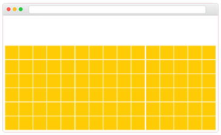

# **Evaluation's Objectives**

- Deep understanding of React / React Native
- Core browser JavaScript api
- Core CSS engine 
- Reusable Code
- Understand scopes and garbage collection in the browser

## Code 

**We are looking for:**

- custom state management  implementation 
- readability
- decoupled & reusable code 
- usage of both built-in and/or custom hooks

**You can use 1 core utility library +  1 framework library**

- React / React Native
- No 3rd party tools such as Redux, Recoil. 
- Ramda / Lodash / Underscore / ETC

BDD tests are not required. But you are free to implement them if you see fit. 

## Visual

- No CSS pre processers
- CSS Module Level 4 (Experimental) / Anything that the latest Chrome version supports natively
- Fully responsive

## Design Guide

- Min Tile Size : 100 px
- Max Tile Size: 150 px
- Number of tiles on the screen at any one time, is directly proportional to the available viewport space.

The following screenshots may give you a better idea of the concept, but please feel free to explore further. 

|      |      |
| ---- | ---- |
|      |      |

# About The Game

This is a 2 player, real-time game, where player move a pin around a grid  and seek to collide with the other player to win.

The user controls their pin using the keyboard's arrow keys. 

`LEFT` `RIGHT` `UP` `DOWN`

Each player will play on their own web browser or mobile phone and they should be able to see the other players moves on their grid. 

Each game is considered a room, and only begins after 2 players have joined. The first player, will create a room, and send the id/url of the room to the other player, who can then join the room. 

Any user who visits the room-id/url after both players have started, will become a spectator and can only watch the current game. 

### Rules of play

1. Squares which were occupied in the previous N moves are
   out of bounds for the next move. (N starts at 5 in round 1, and decrements by one for each consecutive rounds)
2. Players start on opposite sides of the board
3. Goal of a game is to collide with the other player to win 1 point.
4. Moves made are final and cannot be undone. 
5. Movement is restricted to 1 square per move.
6. There are a total of 5 rounds which constitute 1 set 
7. The pins and the board will reset after each round. 
8. User with the most points after a set, wins. 

### Bonus Section

*These items are not required, but do feel free to implement them if needed.*

- Network failure on either side, does not end a game. 
- Automated replay of previous game using recorded stats. 
- Statistics
- Logging
- BDD tests
- Reports
- user accounts

