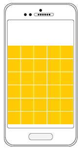

# **Evaluation's Objectives**

- Deep understanding of React / React Native
- Core browser JavaScript api
- Core CSS engine 
- Reusable Code
- Understand scopes and garbage collection in the browser

-----

# About The Game

This is a 2 player, real-time game, where players move a pin around a grid  and seek to collide with the other player to win.

The user controls their pin using the keyboard's arrow keys. 

`LEFT` `RIGHT` `UP` `DOWN`

Each player will play on their own web browser or mobile phone and they should be able to see the other players moves on their grid. 

Each game is considered a room, and only begins after 2 players have joined. The first player, will create a room, and send the id/url of the room to the other player, who can then join the room. 

Any user who visits the room-id/url after both players have started, will become a spectator and can only watch the current game. 

### Rules of play

1. Players start on opposite sides of the board (player tile can be whatever style you wish)
2. Goal of a game is to collide with the other player to win 1 point.
3. Moves made are final and cannot be undone. 
4. Movement is restricted to 1 square per move.
5. There are a total of 5 rounds which constitute 1 set 
6. The pins and the board will reset after each round. 
7. User with the most points after a set, wins. 

### Bonus Section

*These items are not required, but do feel free to implement them if needed.*

- Network failure on either side, does not end a game.
- Digitally signed data exchange.
- Automated replay of previous game using recorded stats. 
- Statistics
- Logging
- BDD tests
- Reports
- user accounts

## Code 

**We are looking for:**

- Custom state management & implementation (including encryption)
- Encryption of data exchange
- Readability
- Decoupled & reusable code 
- Usage of both built-in and/or custom hooks

**You can use 1 core utility library +  1 framework library**

- React / React Native
- 1 utility library Ramda, Lodash, Underscore etc.. is allowed
- No 3rd party state management tools such as Redux, Recoil. 
- You are free to use a browser based crypto library if you need to.

BDD tests are not required. But you are free to implement them if you see fit. 

## Visual

- No CSS pre processers
- CSS Module Level 4 (Experimental) / Anything that the latest Chrome version supports natively
- Fully responsive

## Design Guide

- Min Tile Size : 100 px
- Max Tile Size: 150 px
- Player tile can be any design you want.
- Number of tiles on the screen at any one time, is directly proportional to the available viewport space. (Assume that the user will not change viewport size during the game)

The following screenshots may give you a better idea of the concept, but please feel free to explore further. 

|      |      |
| ---- | ---- |
|      |      |

